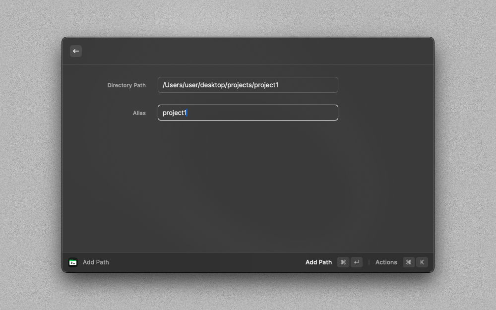
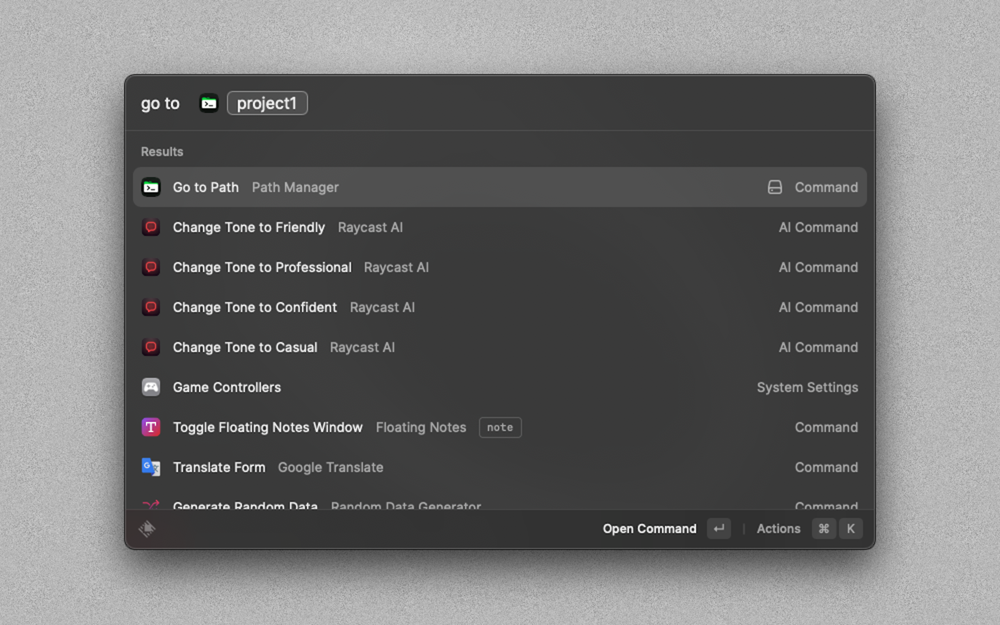
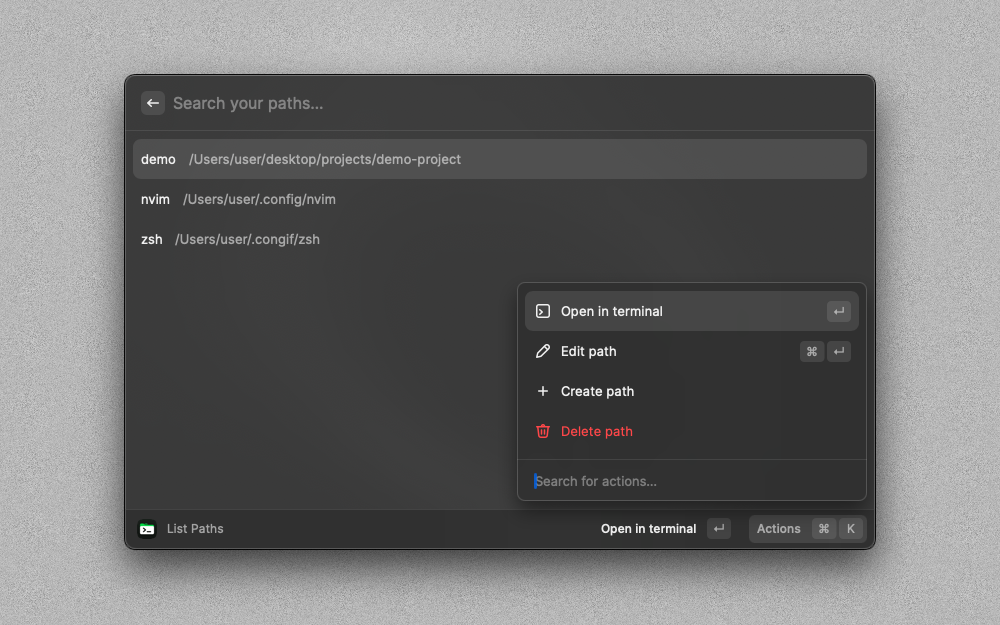

# Path Manager Raycast Extension

## Overview

Path Manager allows you to easily manage and navigate to various file paths on your system. With a simple and intuitive interface, you can add, list, and open paths with aliases for quick access.

## Features

### Add Path

The **Add Path** command lets you store a file path with an alias for easy access later. Simply input the full directory path and assign an alias. The path is then saved to a local database or file for later use.

- **Inputs**:
  - `Path`: The full directory path you want to save.
  - `Alias`: A shorthand or nickname for the path.

### List Paths

With the **List Paths** command, you can view all your saved paths and their aliases. This command provides a search function to quickly locate a path, along with options to go to the path in the terminal, delete, edit, or add new paths.

- **Features**:
  - Search functionality
  - Action Panel Options:
    - Go to path in terminal
    - Delete path
    - Edit path
    - Add path

### Open Path

The **Go To Path** command allows you to open a terminal tab navigating to the chosen path. Enter the alias of the path you want to navigate to, and the extension takes care of the rest.

- **Inputs**:
  - `Alias`: The alias of the path you want to open.

## Configuration

Upon installation, Path Manager supports both the default terminal and iTerm. You can configure your preference in the extension settings within Raycast.
